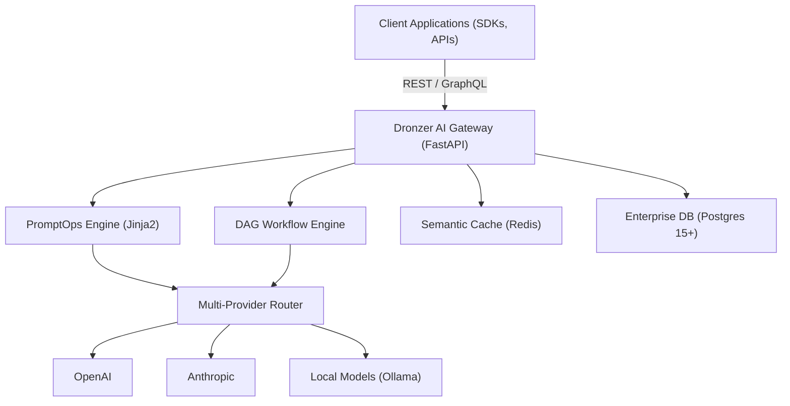
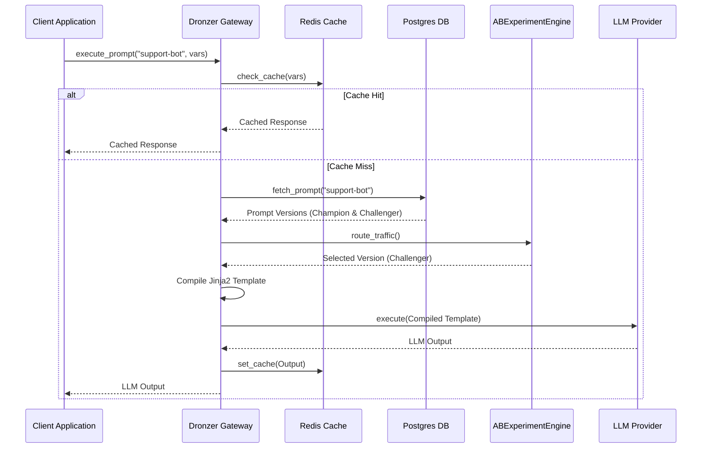
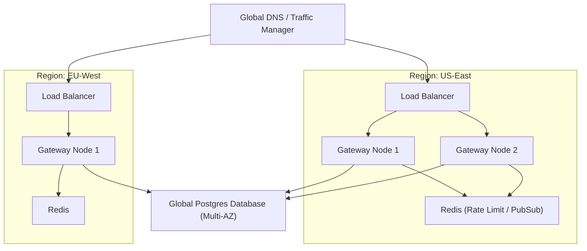

# Dronzer v2.0 Architecture Diagrams

This document contains Mermaid diagrams illustrating the core architecture, sequence flows, and deployment topologies of the Dronzer Platform.

## 1. High-Level Architecture

## 2. Sequence Diagram: Prompt Execution & A/B Testing

## 3. Kubernetes Multi-Cluster Deployment Topology

